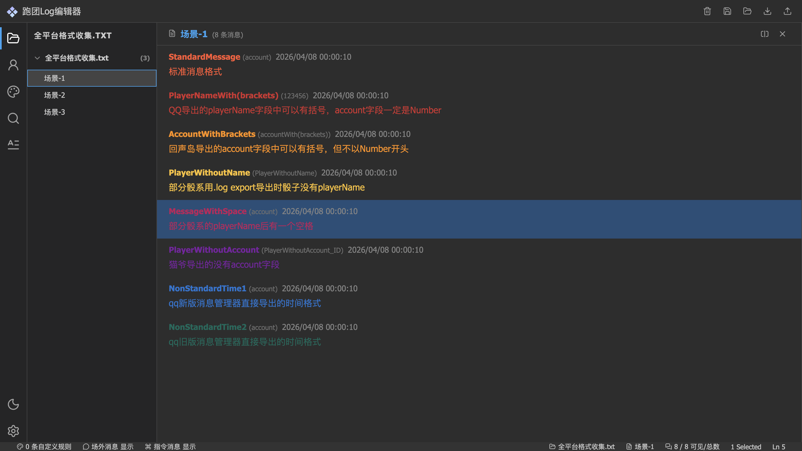
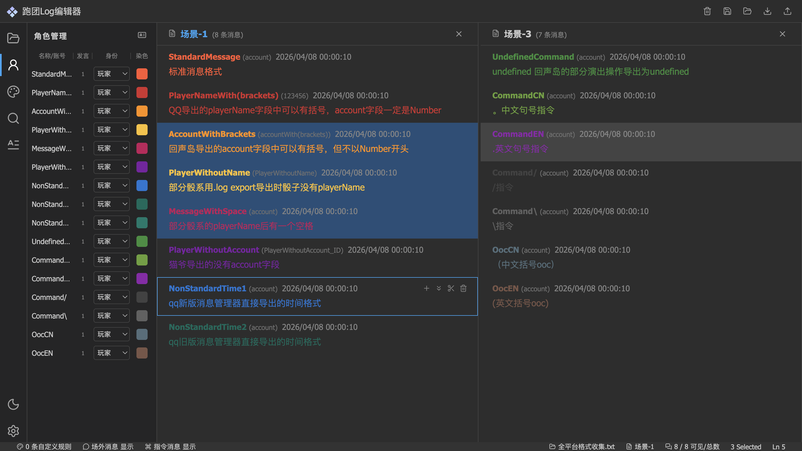

# Freecell Log Studio

一个面向跑团（TRPG）日志整理的前端工具，提供从导入、编辑到导出的完整工作流。
UI 风格参考 VSCode。

主要面向跑团玩家及有日志整理需求的用户。

---

## Preview

示例日志处理效果：





---

## Features

### 核心功能

- **日志导入**：支持多来源适配导入
- **自动分块与结构化解析**：智能识别日志结构，自动拆分为文档/场景/消息
- **消息编辑**：支持内容修改、双击编辑、批量操作
- **撤销 / 重做**：完整的历史记录管理
- **拖拽重排**：支持消息级和场景级的拖拽排序
- **身份管理**：角色与账号的区分管理，支持批量改名和角色分配
- **自定义规则染色**：灵活的高亮规则配置，支持优先级、多条件筛选
- **消息搜索与过滤**：支持全文搜索和高级筛选
- **导出模板自定义**：自由定义输出格式，支持占位符语法
- **导出预览**：导出效果预览
- **本地存储**：项目保存/恢复，支持多版本管理
- **分屏模式**：支持单/双视图并排编辑
- **多格式导出**：TXT、HTML、DOC、DOCX

### 增强特性

在常见日志染色工具的基础上，本项目做了以下结构化与可控性方面的增强：

- 支持消息级排序与拖拽重排
- 支持按文档/场景对日志进行结构化整理
- 支持自定义染色规则（而非固定规则）
- 染色范围可配置（仅名称 / 仅内容 / 全部）
- 支持自定义导出模板（控制最终输出结构）
- 支持本地快照保存与恢复

---

## Tech Stack

- **框架**：Vue 3（Composition API）
- **构建工具**：Vite
- **语言**：TypeScript
- **图标库**：Lucide Vue

---

## Getting Started

### 安装与运行

```bash
# 安装依赖
npm install

# 启动开发服务器
npm run dev

# 构建生产版本
npm run build
```

---

## Project Structure

- `editor/`：核心逻辑（过滤、样式、身份处理等）
- `io/`：导入 / 导出 / 本地存储
- `composables/`：Vue 逻辑封装
- `stores/`：状态管理
- `components/`：UI 组件
- `utils/`：通用工具函数

---

## 核心功能详解

### 身份管理

提供两种管理模式：

- **按角色名**：以 `playerName` 为维度聚合
- **按账号**：以 `account` 为维度聚合

支持批量改名、角色分配（玩家/NPC/主持人/骰子/观众）和自定义染色。

### 染色规则

- **系统规则**：自动为每个身份生成基础规则
- **自定义规则**：支持多条件筛选
- **优先级**：数字越大越优先，高优先级覆盖低优先级
- **染色范围**：可配置仅名称、仅内容或全部
- **选区绑定**：可将当前选中的消息直接绑定到规则

### 导出模板

支持自定义占位符语法：

| 占位符          | 说明     |
| --------------- | -------- |
| `{{ name }}`    | 角色名   |
| `{{ account }}` | 账号     |
| `{{ content }}` | 消息内容 |
| `{{ time }}`    | 时间     |
| `\t`            | 制表符   |
| `\n`            | 换行符   |

可配置项：

- 文件后缀
- 消息分隔符
- 幕间分隔符
- 场景分隔符
- 消息布局模板

### 快捷键

| 快捷键             | 功能           |
| ------------------ | -------------- |
| `Ctrl + A`         | 全选           |
| `Esc`              | 取消选择       |
| `Ctrl + C`         | 复制           |
| `Ctrl + V`         | 粘贴           |
| `Ctrl + Z`         | 撤销           |
| `Ctrl + Y`         | 重做           |
| `Ctrl + E`         | 合并选中消息   |
| `Ctrl + ↑/↓`       | 选中上/下一条  |
| `Ctrl + D`         | 选中相同发言人 |
| `Ctrl + /`         | 切换 OOC 标记  |
| `Ctrl + \`         | 切换指令标记   |
| `Ctrl + Backspace` | 删除选中消息   |
| `Ctrl + S`         | 保存到本地     |
| `Ctrl + P`         | 导出预览       |
| `Ctrl + B`         | 切换左侧边栏   |
| `Ctrl + I`         | 切换右侧边栏   |
| `Ctrl + K`         | 打开帮助文档   |

---

## 本地存储

项目支持将当前工作状态保存到浏览器本地存储（localStorage），包括：

- 所有文档、场景、消息数据
- 染色规则配置
- 导出模板配置
- UI 偏好设置

---

## License

MIT
