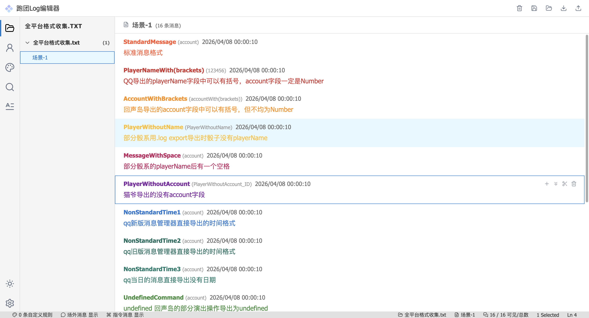

# Freecell Log Studio

一个面向跑团（TRPG）日志整理的前端工具，提供从导入、编辑到导出的完整工作流。
UI 风格参考 VSCode，强调结构化处理与高可控性。

主要面向跑团玩家及有日志整理需求的用户。

---

## Preview

示例日志处理效果：



## Features

- 日志导入（多来源适配）
- 自动分块与结构化解析
- 消息编辑与内容修改
- 撤销 / 重做
- 拖拽重排
- 身份管理（角色/账号区分）
- 自定义规则染色
- 消息搜索与过滤
- 导出模板自定义
- 导出预览
- 本地存储（项目保存 / 恢复）
- 多格式导出：
    - TXT
    - HTML
    - DOCX

---

## Enhancements over existing log highlighters

在常见日志染色工具的基础上，本项目做了一些结构化与可控性方面的增强：

- 支持消息级排序与拖拽重排
- 支持按场景 / 分幕对日志进行结构化整理
- 提供基础统计功能（消息数量、选中范围等）
- 支持自定义染色规则（而非固定规则）
- 染色范围可配置（仅名称 / 仅内容 / 全部）
- 支持自定义导出模板（控制最终输出结构）
- 支持本地快照保存与恢复

这些能力使日志不仅可以“染色”，还可以进行结构化编辑与再组织。

---

## Tech Stack

- Vue 3
- Vite
- TypeScript

---

## Getting Started

```bash
npm install
npm run dev
```

---

## Project Structure

- `editor/`：核心逻辑（过滤、样式、身份处理等）
- `io/`：导入 / 导出 / 本地存储
- `composables/`：Vue 逻辑封装
- `stores/`：状态管理
- `components/`：UI 组件
- `utils/`：通用工具函数

---

## Roadmap

计划中的改进方向：

- 更完善的焦点管理（键盘操作与编辑状态一致性）
- 多窗口 / 多视图支持（提升复杂日志的编辑效率）

当前优先保证核心编辑与导出流程的稳定性。

---

## License

MIT
